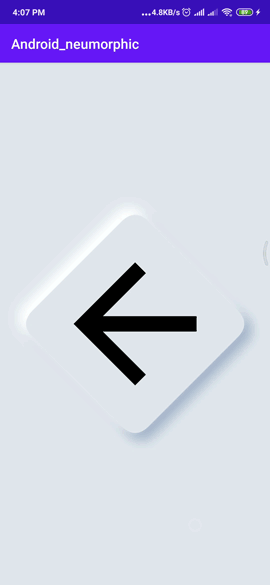

<div align="center">



</div>

# Android_neumorphic
## neumorphic (sof-ui) library for android  
#### based on https://github.com/florent37/ShapeOfView
---
**NOTE**
This is not a free library. But it has been published based on your trust. If you use this library in your software, be sure to pay the price.
- If this library was very useful ... $ 99
- If it only saves your time ... $ 29
- buy at here --> 
My Wallet (bitCoin)
 
1N9T5PbQJbidhyfVXcpotpdrjMgdKvsbo2
---
🔧 Easy Installation 🔧 click here -> 
[](https://jitpack.io/#sshadkany/Android_neumorphic)
--
## ✔️some exmaples !!
### with 3 basic shape + Dark Mode
|  |  |  
|------------|-------------|--------------|
|code in [activity_secend.xml](app/src/main/res/layout/activity_secend.xml) |  code in [activity_secend.xml](app/src/main/res/layout/activity_secend.xml) | code in [activity_circle_image_button.xml](app/src/main/res/layout/activity_circle_image_button.xml)

### can works nested and make amazing views !!
| | |
|-----------------|----------------|
|code in [activity_main.xml](app/src/main/res/layout/activity_main.xml) |code in [activity_3.xml](app/src/main/res/layout/activity_3.xml)

### can create multiLine neomorphic text !!
| |
|-----------------|
|code in [activity_neo_text.xml](app/src/main/res/layout/activity_neo_text.xml) |

## how to use ?? 👞 by 👞 
### 1.first install library 
### 2.use this code for circle neumorphic view
```xml
    <com.github.sshadkany.shapes.CircleView
        android:id="@+id/btn35"
        android:layout_width="200dp"
        android:layout_height="200dp"
        android:layout_margin="5dp"
        app:layout_constraintStart_toStartOf="parent"
        app:layout_constraintTop_toBottomOf="parent"
        app:shape_circle_backgroundColor="#ECF0F3"
        app:shape_circle_shadow_type="drop_shadow" />
```
### 3.a better example 
||
|-------------|
|code in [activity_style.xml](app/src/main/res/layout/activity_style.xml)|

### you can play with every paramter!! 
||
|-------------|
|code in [activity_5.xml](app/src/main/res/layout/aactivity_5.xml)|
```xml
        app:shape_circle_shadow_position_y="-30dp"
        app:shape_circle_shadow_position_x="40dp"
        app:shape_circle_dark_color="@color/colorPrimary"
        app:shape_circle_light_color="@color/colorAccent"

        app:shape_circle_borderColor="@color/colorPrimaryDark"
        app:shape_circle_borderWidth="4dp"
```

### how make a button ?? (easy way)
| |
|----------|
|code in [activity_circle_image_button.xml](app/src/main/res/layout/activity_circle_image_button.xml)|
```xml
    <com.github.sshadkany.CircleButton
        android:id="@+id/circle_image_button"
        android:layout_width="match_parent"
        android:layout_height="400dp">

        <ImageView
            android:id="@+id/imageView2"
            android:layout_width="match_parent"
            android:layout_height="match_parent"
            android:layout_gravity="center"
            android:padding="32dp"
            android:tint="#100F0F"
            app:srcCompat="@drawable/abc_vector_test" />

    </com.github.sshadkany.CircleButton>
```
and in java class
```java
        CircleButton circle_button = findViewById(R.id.circle_image_button);
        circle_button.setOnClickListener(new View.OnClickListener() {
            @Override
            public void onClick(View v) {
                Log.i("neo", "onClick: i am clicked");
            }
        });
```
### more examples
| || |
|-----------------|----------------|-------------------|
|code in [activity_rect_button.xml](app/src/main/res/layout/activity_rect_button.xml)|code in [activity_polygon_button.xml](app/src/main/res/layout/activity_polygon_button.xml)|code in [activity_polygon_button.xml](app/src/main/res/layout/activity_polygon_button.xml) 
### how make Darkmode
change this three color 
```xml
        app:shape_roundRect_backgroundColor="#303234"
        app:shape_roundRect_light_color="#66494949"
        app:shape_roundRect_dark_color="#66000000"
```

### how make a button ?? (Advanced way)
| |
|----------|
|code in [activity_button.xml](app/src/main/res/layout/activity_button.xml)|

```java
              final neo mybtn = findViewById(R.id.my_button);
        ViewGroup viewGroup = findViewById(R.id.my_button);
        final ImageView imageview = (ImageView) viewGroup.getChildAt(0);
        mybtn.setOnTouchListener(new View.OnTouchListener() {
            @Override
            public boolean onTouch(View v, MotionEvent event) {
                // is shape Contains Point ----> for detect place of Touch is in the shape or not
                if (mybtn.isShapeContainsPoint(event.getX(), event.getY())) {
                    switch (event.getAction()) {
                        case MotionEvent.ACTION_DOWN:
                            // PRESSED
                            mybtn.setStyle(neo.small_inner_shadow);
                            imageview.setScaleX(imageview.getScaleX() * 0.9f);
                            imageview.setScaleY(imageview.getScaleY() * 0.9f);
                            return true; 
                        case MotionEvent.ACTION_UP:
                        case MotionEvent.ACTION_CANCEL:
                            // RELEASED
                            mybtn.setStyle(neo.drop_shadow);
                            imageview.setScaleX(1);
                            imageview.setScaleY(1);
                            return true; 
                    }
                }
                return false;
            }
        });
    }
```
